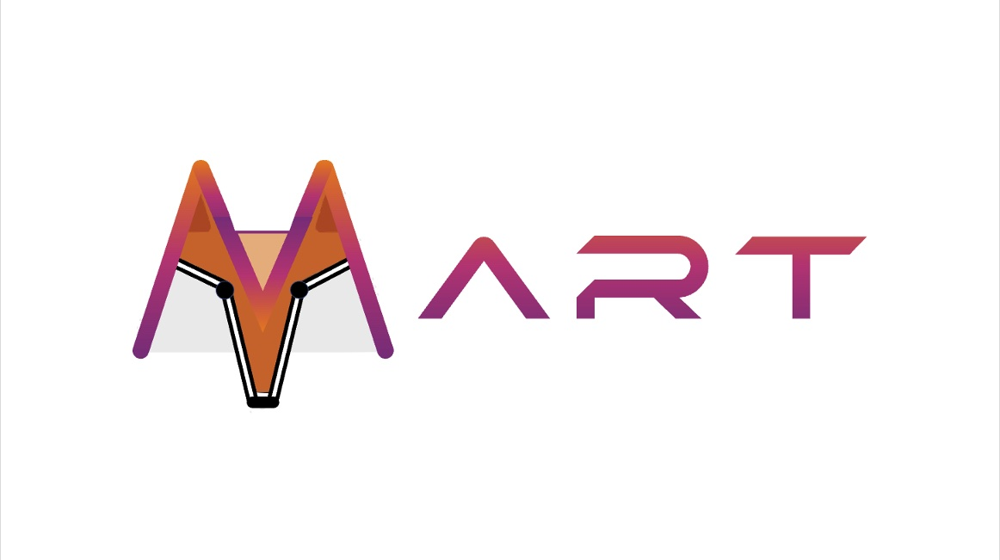

我目前是一名硕士二年级的研究生，就读于[南开大学](https://www.nankai.edu.cn/)[计算机学院](https://cc.nankai.edu.cn/)，于2022年加入计算机视觉实验室，导师是[杨巨峰](https://cv.nankai.edu.cn/)教授。在此之前，我于2022年获得[四川大学](https://www.scu.edu.cn/)计算机科学与技术学士学位。

在就读期间，我很荣幸得到南开大学[范登平](https://dengpingfan.github.io/)教授和清华大学[徐鹏](https://www.pengxu.net/)老师的共同指导。

我的研究兴趣主要围绕计算机视觉和机器学习，特别关注伪装视觉感知，多模态学习和视频理解等任务。

 
 

新闻
======

<ul style="padding-left: 40px; padding-bottom: 0px;">
  <li>[06/2024] 我将前往 阿里巴巴 (杭州)  进行暑期实习。</li>
  <li>[06/2024] 我将前往美国西雅图参加 CVPR 2024.</li>
  <li>[05/2024] 我将参加 VALSE 2024 (Chongqing)  和 CCIG 2024 (Xi‘an)  并且在会议现场做Posetr分享，欢迎大家与我现场交流。 </li>
  <li>[02/2024] 两篇分别关于伪装图像生成和视频情感分析的论文被IEEE国际计算机视觉与模式识别大会（CVPR 2024）接收。</li>
  <li>[09/2022] 我进入南开大学（NKU）计算机学院开始硕士阶段的学习，师从<a href="https://cv.nankai.edu.cn/">杨巨峰教授</a>。</li>       
</ul>

 
 

论文
======

<!-- 
More publications can be found in <a href="">Google Scholar</a>.
 -->

<!-- 
† indicates equal contribution.
 -->

<!-- LAKERED CVPR24 -->

  

    

      
CVPR 2024

      
    

  

  

		 
<a href="/publication/LAKERED_CVPR24">LAKE-RED: 基于隐空间背景知识检索和增强扩散的伪装图像生成</a>

    
<strong>赵攀诚</strong>, 徐 鹏, 秦鹏达, 范登平, 张知诚, 贾国力, 周伯文, 杨巨峰

    
    
IEEE国际计算机视觉与模式识别大会（CVPR）, 西雅图, 美国, 2024年6月17-21日。

    
    		
    
  

<!-- MART CVPR24 -->

  

    

      
CVPR 2024

      
    

  

  

		 
<a href="/publication/MART_CVPR24">MART: 基于掩码时序分布蒸馏的情感表示学习</a>

<!-- 
Zhicheng Zhang†, <strong>Pancheng Zhao†</strong>, Eunil Park, Jufeng Yang
 -->

张知诚, <strong>赵攀诚</strong>, Eunil Park, 杨巨峰

IEEE国际计算机视觉与模式识别大会（CVPR）, 西雅图, 美国, 2024年6月17-21日。

	 	

  

 

访问
======

<!--
-->

