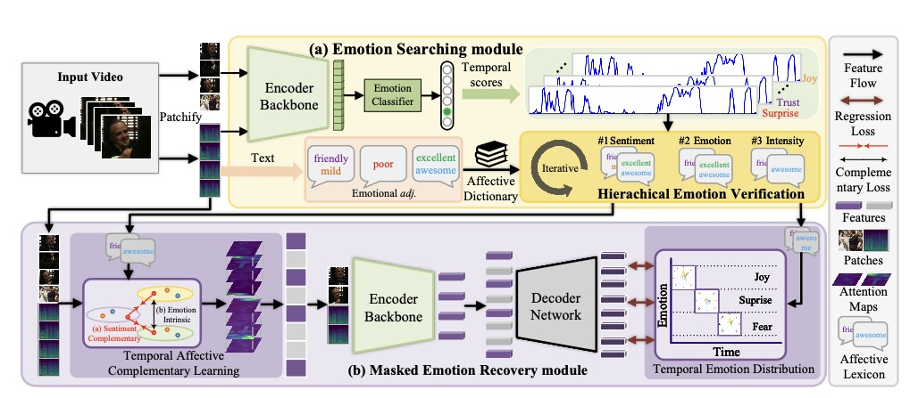

<!-- Limited training data is a long-standing problem for video emotion analysis (VEA). Existing works leverage the power of large-scale image datasets for transferring while failing to extract the temporal correlation of affective cues in the video. Inspired by psychology research and empirical theory, we verify that the degree of emotion may vary in different segments of the video, thus introducing the sentiment complementary and emotion intrinsic among temporal segments. Motivated by this, we propose an MAE-style method for learning robust affective representation of videos via masking, termed MART. The method is comprised of emotional lexicon extraction and masked emotion recovery. First, we extract the affective cues of the lexicon and verify the extracted one by computing its matching score with video content. The hierarchical verification strategy is proposed, in terms of sentiment and emotion, to identify the matched cues alongside the temporal dimension. Then, with the verified cues, we propose masked affective modeling to recover temporal emotion distribution. We present temporal affective complementary learning that pulls the complementary part and pushes the intrinsic part of masked multimodal features, for learning robust affective representation. Under the constraint of affective complementary, we leverage cross-modal attention among features to mask the video and recover the degree of emotion among segments. Extensive experiments on three benchmark datasets demonstrate the superiority of our method in video sentiment analysis, video emotion recognition, multimodal sentiment analysis, and multimodal emotion recognition. -->
Abstract: Coming soon...

**Recommended citation:**

~~~
@inproceedings{zhang2024masked,
  author = {Zhang, Zhicheng and Zhao, Pancheng and Park, Eunil and Yang, Jufeng},
  title = {MART: Masked Affective RepresenTation Learning via Masked Temporal Distribution Distillation},
  booktitle = {Proceedings of the IEEE/CVF Conference on Computer Vision and Pattern Recognition (CVPR)},
  year = {2024},
}
~~~

