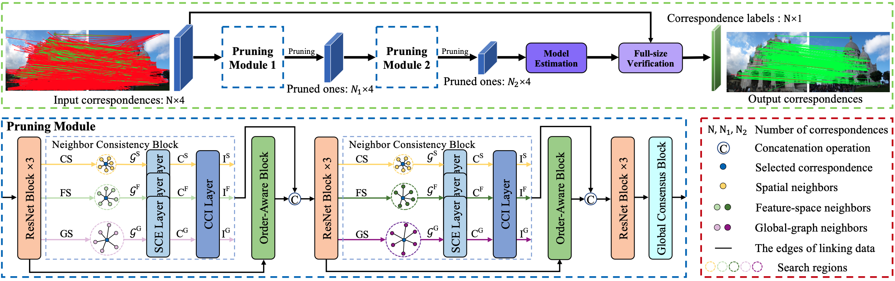

 
 
    	

Correspondence pruning plays a crucial role in a variety of feature matching based tasks, which aims at identifying correct correspondences (inliers) from initial ones. Seeking consistent k-nearest neighbors in both coordinate and feature spaces is a prevalent strategy employed in previous approaches. However, the vicinity of an inlier contains numerous irregular false correspondences (outliers), which leads them to mistakenly become neighbors according to the similarity constraint of nearest neighbors. To tackle this issue, we propose a global-graph space to seek consistent neighbors with similar graph structures. This is achieved by using a global connected graph to explicitly render the affinity relationship between correspondences based on the spatial and feature consistency. Furthermore, to enhance the robustness of method for various matching scenes, we develop a neighbor consistency block to adequately leverage the potential of three types of neighbors. The consistency can be progressively mined by sequentially extracting intra-neighbor context and exploring inter-neighbor interactions. Ultimately, we present a Neighbor Consistency Mining Network (NCMNet) to estimate the parametric models and remove outliers. Extensive experimental results demonstrate that the proposed method outperforms other state-of-the-art methods on various benchmarks for two-view geometry estimation. Meanwhile, four extended tasks, including remote sensing image registration, point cloud registration, 3D reconstruction, and visual localization, are conducted to test the generalization ability 
<!-- Abstract: Coming soon... -->

**Recommended citation:**

~~~
@article{liu2024ncmnet,
  title={NCMNet: Neighbor Consistency Mining Network for Two-View Correspondence Pruning},
  author={Liu, Xin and Qin, Rong and Yan, Junchi and Yang, Jufeng},
  journal={IEEE Transactions on Pattern Analysis and Machine Intelligence},
  number={},
  pages={1--19},
  year={2024},
  publisher={IEEE}
}
~~~