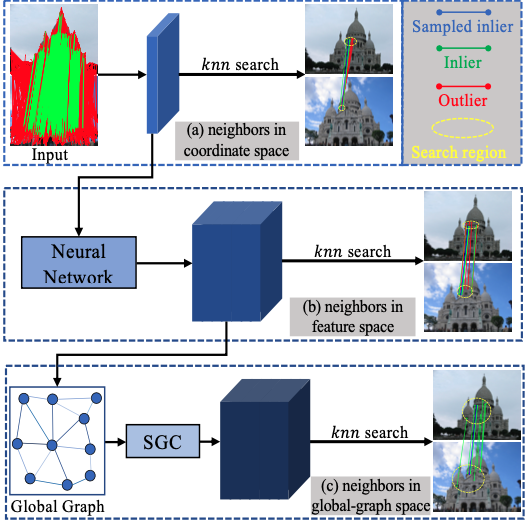
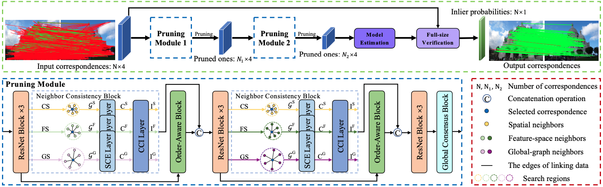

    	

The goal of correspondence pruning is to recognize correct correspondences (inliers) from initial ones, with applications to various feature matching based tasks. Seeking neighbors in the coordinate and feature spaces is a common strategy in many previous methods. However, it is difficult to ensure that these neighbors are always consistent, since the distribution of false correspondences is extremely irregular. For addressing this problem, we propose a novel global-graph space to search for consistent neighbors based on a weighted global graph that can explicitly explore long-range dependencies among correspondences. On top of that, we progressively construct three neighbor embeddings according to different neighbor search spaces, and design a Neighbor Consistency block to extract neigh- bor context and explore their interactions sequentially. In the end, we develop a Neighbor Consistency Mining Network (NCMNet) for accurately recovering camera poses and identifying inliers. Experimental results indicate that our NCMNet achieves a significant performance advantage over state-of-the-art competitors on challenging outdoor and indoor matching scenes.
<!-- Abstract: Coming soon... -->

**Recommended citation:**

~~~
@inproceedings{liu2023ncmnet,
  author    = {Liu, Xin and Yang, Jufeng},
  title     = {Progressive Neighbor Consistency Mining for Correspondence Pruning},
  booktitle = {Proceedings of the IEEE/CVF Conference on Computer Vision and Pattern Recognition (CVPR)},
  month     = {June},
  year      = {2023},
  pages     = {9527-9537}
}
~~~