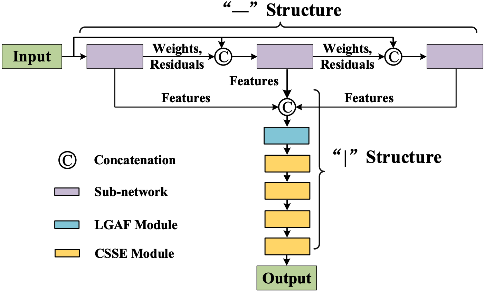
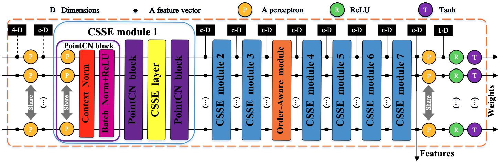

    	

We propose a conceptually novel, flexible, and effective framework (named T-Net++) for the task of two-view correspondence pruning. T-Net++ comprises two unique structures: the “−” structure and the “|” structure. The “−” structure utilizes an iterative learning strategy to process correspondences, while the “|” structure integrates all feature information of the “ − ” structure and produces inlier weights. Moreover, within the “|” structure, we design a new Local-Global Attention Fusion module to fully exploit valuable information obtained from concatenating features through channel-wise and spatial-wise relationships. Furthermore, we develop a Channel-Spatial Squeeze-and-Excitation module, a modified network backbone that enhances the representation ability of important channels and correspondences through the squeeze-and-excitation operation. T-Net++ not only preserves the permutation-equivariance manner for correspondence pruning, but also gathers rich contextual information, thereby enhancing the effectiveness of the network. Experimental results demonstrate that T-Net++ outperforms other state-of-the-art correspondence pruning methods on various benchmarks and excels in two extended tasks.
<!-- Abstract: Coming soon... -->

**Recommended citation:**

~~~
@article{xiao2024t,
  title={T-Net++: Effective Permutation-Equivariance Network for Two-View Correspondence Pruning},
  author={Xiao, Guobao and Liu, Xin and Zhong, Zhen and Zhang, Xiaoqin and Ma, Jiayi and Ling, Haibin},
  journal={IEEE Transactions on Pattern Analysis and Machine Intelligence},
  year={2024},
  pages={1--15},
  publisher={IEEE}
}
~~~